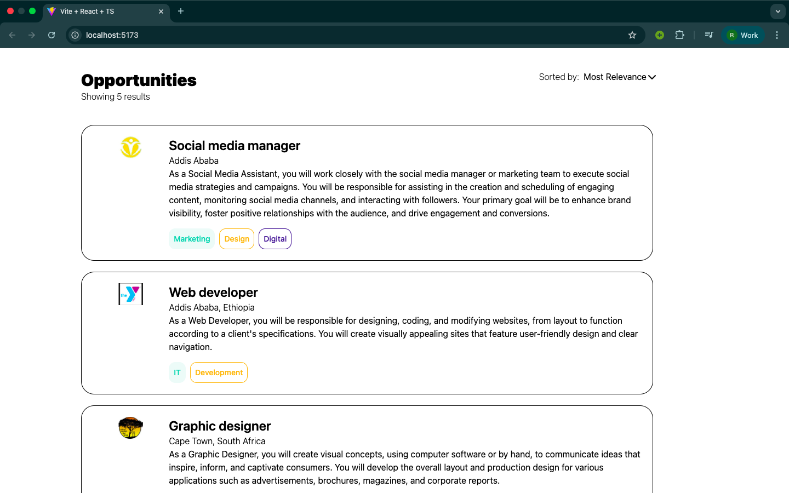
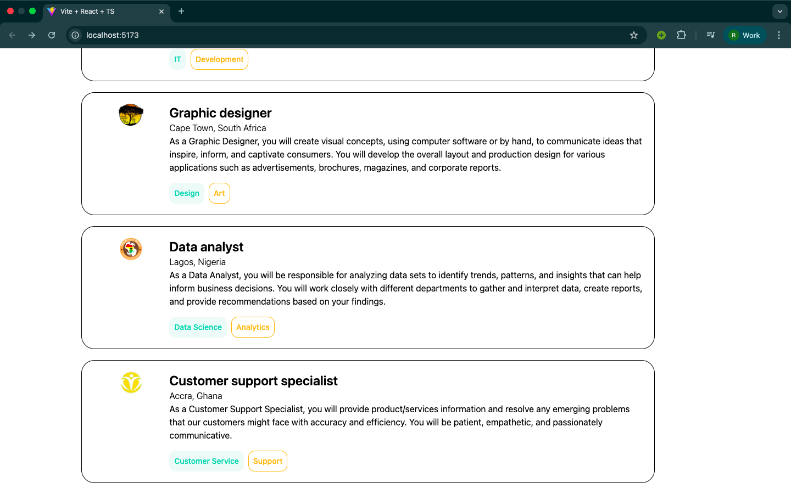
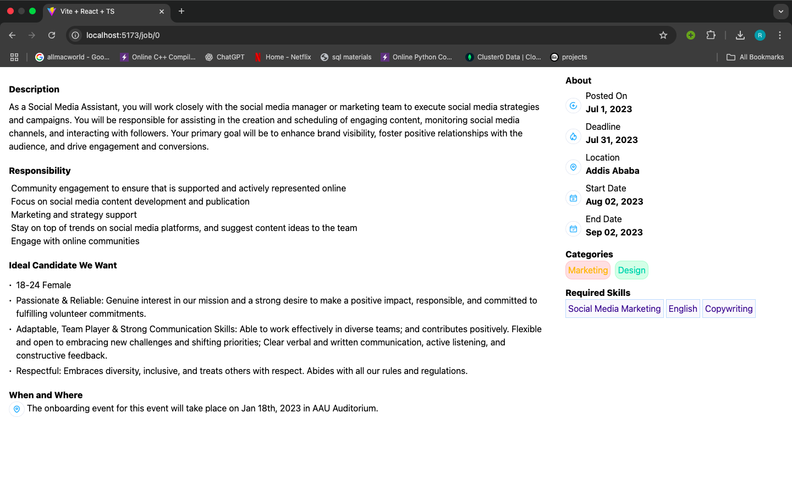

# Job Listing Platform

A job listing web application built using React, TypeScript, and Tailwind CSS. The platform displays jobs along with their descriptions.

## A Homepage where users view job lists.




## The detailed job description page of the selected job.



## Technologies Used

- React
- Typescript
- Tailwind CSS

## Installation & Setup

1. **Clone the repository:**

   ```bash
   git clone https://github.com/Ruth652/Job-listing-app.git
   cd Job-listing-app
   ```

2. **Install dependencies:**

   ```bash
   npm install
   ```

3. **Run the development server:**

   ```bash
   npm run dev
   ```
